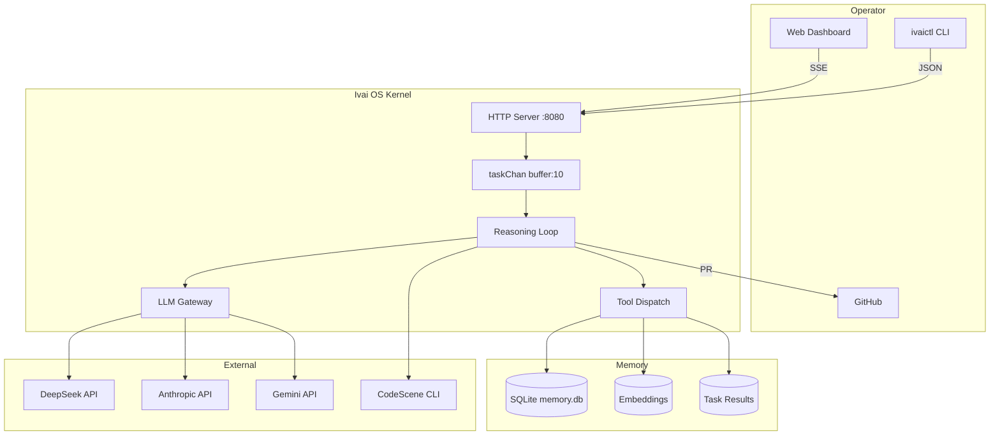
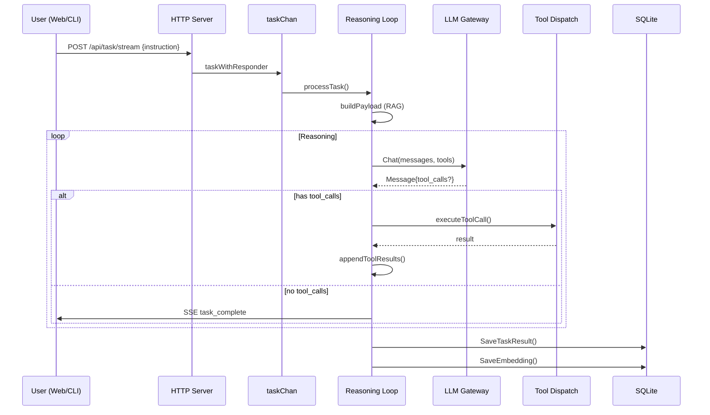
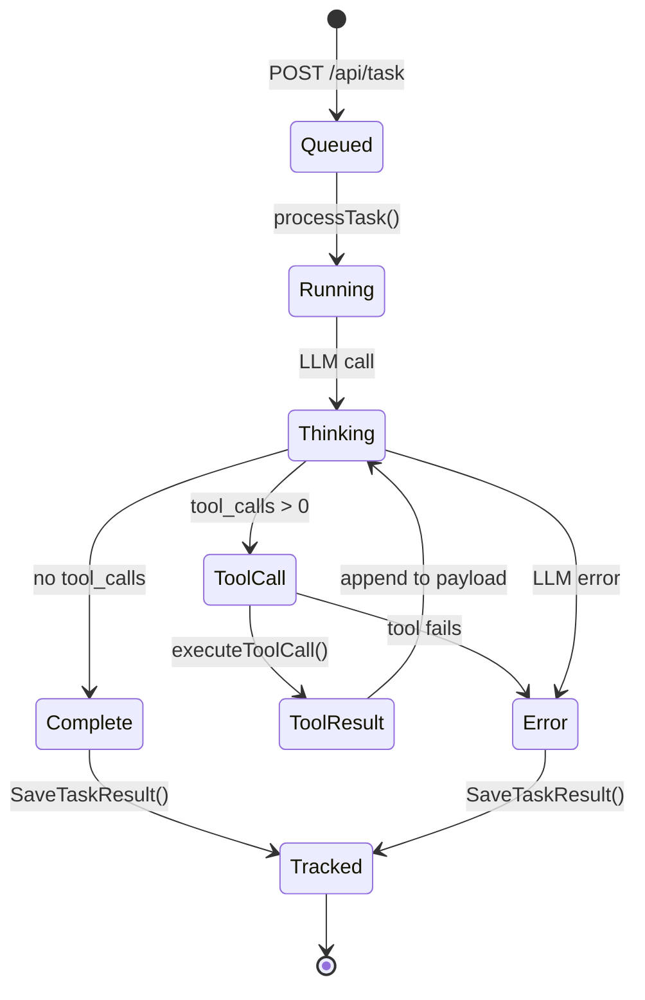

# Ivai OS v0.1.0: Technical Architecture Specification

## System Context



## Data Flow



## Task Lifecycle



Ivai OS has transitioned from a simple Go script to a daemonized, agentic operating system kernel. This document specifies the current internal architecture and subsystems.

## Source Tree

```
cmd/
├── ivai/                     # Main binary (~15 files)
│   ├── main.go               # Minimal startup, HTTP handlers, CLI, event loop
│   ├── process.go            # TaskInput, taskState, reasoning loop, payload builder, RAG
│   ├── tools.go              # defineTool, buildTools (core/github/swarm), executeToolCall
│   ├── github_tools.go       # GitHub PR, issues, code health, wiki executors
│   ├── swarm.go              # VM worker swarm: clone/deploy/dispatch/gather/status/spawn/kill
│   ├── tool_registry.go      # Handler dispatch map (tool name → Go function)
│   ├── dashboard.go          # Single-page web dashboard (embedded HTML/CSS/JS)
│   ├── SYSTEM_PROMPT.md      # Ivai's self-knowledge (embedded at build)
│   └── main_test.go          # Tests for processTask, SSE, regression, swarm
├── ivaictl/                  # Mac CLI client
│   └── main.go
internal/
├── tools/                    # Low-level primitives: fs, network, shell
├── memory/                   # SQLite with embeddings and task tracking
├── sandbox/                  # Wazero WebAssembly runtime
├── llm/                      # Multi-model LLM gateway (DeepSeek, Anthropic, Gemini)
└── telemetry/               # OpenTelemetry setup
```

## 1. Core Architecture (The Kernel)

- **Runtime**: Pure Go (linux/arm64) binary running inside a minimal Debian OrbStack VM.
- **Daemonization**: Managed by systemd (`ivai.service`). Runs automatically on boot, self-heals on crashes, and pipes structured JSON logs to the system journal via `journald`.
- **Privilege Isolation**: Executes under a dedicated, restricted Linux system user (`ivai`) with zero password login or sudo privileges.
- **Configuration**: Secrets loaded via `godotenv` from a locked-down file (`/etc/ivai/.env` with 600 permissions).
- **Modular Code Structure**: The binary's source in `cmd/ivai/` is split across five files by responsibility — `main.go` (minimal startup + HTTP + CLI), `process.go` (task processing + reasoning loop), `tools.go` (tool definitions + dispatcher), `github_tools.go` (GitHub/Git/CodeScene executors), and `swarm.go` (VM worker lifecycle). Each file independently scores CodeHealth 10.0.
- **Fault-Tolerant Initialization**: Every component (tracer, memory store, LLM gateway) initializes independently. Failures are logged as warnings and the system continues with degraded functionality rather than crashing. If the memory DB fails to mount, the kernel runs without persistence; if all API keys are missing, tasks return an error gracefully.

## 2. Cognitive Engine (The Brain)

- **LLM Gateway**: Multi-model support for DeepSeek-V4-Pro, Anthropic (Claude 3.5), and Google Gemini 1.5 Pro utilizing a unified Tool Calling standard. Supports seamless model swapping via instruction-level hints (e.g., `@claude`, `@gemini`).
- **Reasoning Loop**: A recursive Go `for` loop that intercepts tool requests, executes local Go functions, feeds the results back to the LLM (DeepSeek, Anthropic, or Gemini), and continues chaining actions autonomously until a final textual answer is reached.

## 3. Memory Subsystem (The Context)

- **Storage Engine**: Embedded pure-Go SQLite (`modernc.org/sqlite`), eliminating CGO dependencies.
- **Data Structure**: A continuous `messages` table storing the conversation and tool-execution history at `/etc/ivai/memory.db`.
- **Context Window**: Automatically fetches the last 10 interactions to maintain a rolling short-term memory across daemon restarts.

## 4. Execution Subsystems (The Hands)

17 tools are available to the reasoning loop, grouped into categories:

- **File I/O** (`read_file`, `write_file`)**: Grants the agent ability to read host files and write raw code/configurations to disk.
- **System Shell** (`execute_command`)**: Utilizes `os/exec` wrapped in a `bash -c` subshell. Allows the agent to run native Linux utilities, compile code, and explore its host environment.
- **Wasm Sandbox** (`execute_wasm`)**: An embedded WebAssembly micro-VM using **Wazero**. Enables zero-trust execution of compiled `.wasm` binaries (WASI preview 1 standard) with strict millisecond timeouts and sandboxed standard I/O.
- **Network Tooling** (`http_request`)**: Performs HTTP requests (GET, POST, etc.) using Go's `net/http` client, allowing interaction with external APIs.
- **Version Control / GitHub** (`github_pr`, `create_issue`, `list_issues`, `update_wiki`)**: Autonomous repository management, issue tracking, and wiki editing via `gh` CLI.
- **Code Health** (`code_health`)**: Integration with CodeScene CLI for delta analysis.
- **Swarm Orchestration** (`swarm_clone`, `swarm_deploy`, `swarm_dispatch`, `swarm_gather`, `swarm_status`, `swarm_spawn`, `swarm_kill`)**: VM worker lifecycle management — clone VMs, deploy binaries, dispatch tasks, gather results, and kill workers.

## 5. Interfaces (The Ears)

- **HTTP Server**: A background goroutine listening on port 8080, with two endpoints:
  - `POST /api/task` — blocking task submission (JSON request → JSON response, 120s timeout).
  - `POST /api/task/stream` — SSE (Server-Sent Events) streaming endpoint that emits real-time progress events (`task_start`, `thinking`, `tool_call`, `tool_result`, `task_complete`, `task_error`) as the reasoning loop executes.
- **Mac Client (`ivaictl`)**: A native macOS Go binary that communicates with the kernel via the HTTP API. Supports `--stream` flag for live progress visualization.
- **CLI REPL**: Standard input scanner for interactive terminal debugging (integrated into the kernel event loop). Prints `[Thinking]`, tool calls, and `[Ivai]` responses directly to stdout.

## 6. Observability (The Eyes)

- **SSE Progress Streaming**: Live event stream from `POST /api/task/stream` using `text/event-stream` content type. Events include model selection, reasoning steps, tool calls with arguments, tool results (truncated to 500 chars), and final responses. The `ivaictl --stream` flag parses and pretty-prints these events in real time.
- **Structured Logging**: JSON-format `slog` output to stdout, piped to `journald` on production VMs. Key events: task routing, tool execution, task completion, LLM errors.
- **OpenTelemetry Tracing**: Foundation initialized — spans created for reasoning steps and tool execution. Exporters (Jaeger/OTLP) pending in Phase 8.

## 7. Web Dashboard (The Control Panel)

- **Single-Page App**: Self-contained HTML/CSS/JS embedded via `//go:embed` in `cmd/ivai/dashboard.go`. Zero external dependencies.
- **Six Tabs**:
  - **Dashboard** — runtime stats (uptime, Go version, goroutines, heap, OS/arch), LLM provider status (ready/no-key per provider), auto-refreshes every 30s.
  - **Task Console** — SSE stream viewer with real-time event rendering. Color-coded events (blue=start, purple=thinking, amber=tool_call, orange=tool_result, green=complete, red=error). Uses `fetch` + `ReadableStream` for SSE parsing.
  - **Task Results** — paginated task history with expandable rows, success/fail rates, average duration bar chart.
  - **Memory** — paginated conversation history from SQLite (`GET /api/memory?limit=N&offset=M`). Color-coded role badges, content/reasoning columns, timestamps.
  - **Tools** — lists all 17 tools with parameter names, types, and required status.
  - **System** — embeddings count, message count, task stats, and the full system prompt.
- **API Endpoints**: `GET /api/status` (runtime info), `GET /api/memory` (paginated messages), `GET /api/tools` (tool listing), `GET /api/task-results` (task history), `GET /api/system` (system stats), `GET /api/embeddings` (vector store).

## 8. Self-Knowledge (The Identity)

- **Externalized System Prompt**: `cmd/ivai/SYSTEM_PROMPT.md` — plain Markdown embedded at build time via `//go:embed`. Ivai knows its own anatomy: config files, memory DB schema, build/deploy process, sandbox PR workflow.
- **Self-Provisioning via Crush**: Ivai writes to `.crush/memory/*.md` to teach its operator's AI assistant about its capabilities — the same mechanism Crush used to add the CodeScene code health rule.
- **Safe Self-Modification**: Ivai is instructed to clone source to `/tmp/ivai-sandbox`, modify there, run `go build && go test`, and create a Pull Request — never modify its own running `cmd/` or `internal/` directly.

---

## 🛡️ Security Posture

- **Non-Root Execution**: The kernel runs as a restricted user.
- **Wasm Isolation**: Untrusted code is executed in a memory-safe, capability-based sandbox.
- **Graceful Shutdown**: Handles `SIGTERM` and `SIGINT` to close the database and stop the HTTP server cleanly.
